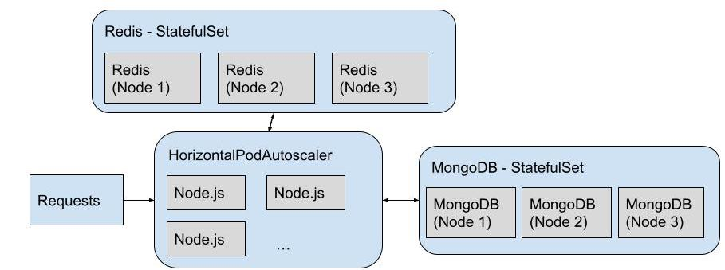
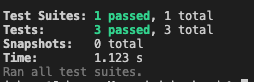

Name: IP Chi Chuen

## Q1. Log Analytics

Names of the shell script file:
`a_count.sh`, `b_top10.sh`, `c_location.sh`

Execute the scripts, where `test.log.gz` is placed in Q1 directory

```
cd Q1
chmod +x *.sh
./a_count.sh
./b_top10.sh
./c_location.sh
```

### a. Count the total number of HTTP requests recorded in this log file

Output:

```
   86086
```

### b. Find the Top 10 hosts that made the most HTTP requests from 2019-06-10 00:00:00 up to and including 2019-06-19 23:59:59

Output:

```
 730 118.24.71.239
 730 1.222.44.52
 723 119.29.129.76
 486 148.251.244.137
 440 95.216.38.186
 440 136.243.70.151
 437 5.189.159.208
 437 213.239.216.194
 436 5.9.71.213
 406 5.9.108.254
```

### c. Find the country that made the most HTTP requests

First, install `geoip-bin` package to get the geolocation from a ip-address. Then execute the scripts.
Output:

```
   2212  US, United States
```

## Q2. System Design and Implementation

### Architecture



| Component Name | Usage      | Features                                 |
| -------------- | ---------- | ---------------------------------------- |
| Node.js        | API server | Stateless, only R/W to MongoDB and Redis |
| MongoDB        | Database   | Faster than normal SQL db                |
| Redis          | Caching    | Memory-based key-value storage           |

### Workflow

#### POST request received in Node.js server

1. Generate a random ID for the url: [a-zA-ZO-9]{9}
2. Save the object consist of original url and shortenUri to MongoDB
3. Save the object to Redis, with ID as the key and object as the value

#### GET request received in Node.js server

1. Use the ID found in the request path as key, try to retrieve the object from Redis
2. If cache hit, get the original uri and 302 redirect to that url
3. If cache miss, use the ID to retrieve object from MongoDB, save it in Redis and 302 redirect to url

- Although it require extra time to read the data from db, it only affect the performance of the first request
- The following requests will be read from high-speed memory-based Redis cache

### Local Development (Mac)

- Use compose.yml to create development MongoDB and Redis instance

```
cd Q2
docker compose up
```

I have prepared simple test cases in test.js file, using `supertest` library

```
cd backend
npm start
npm test
```

Sample result of test



### CI/CD

- I will use Jenkins as the CI/CD server, hosted on my local Linux server
- For each code commit in GitHub, it will send a webhook POST request to the CI/CD server
- Then trigger the process: run the test and build the docker image, then push to Docker Hub

### Kubernetes

- Use Kubernets cluster to host all the required applications, to make the services more reliable
- Assume we have already created a Kubernetes cluster with 3 nodes
- All 3 services (Node.js, Redis, MongoDB) will be deployed with at least 3 replicas
- For my testing purpose, I only use the Kubernetes cluster provided in Docker Desktop on Mac

```
cd Q2
kubectl apply -f kubernetes.yml
```

#### Node.js

- Custom image is built named `johnnyip/url-shorterner:latest`
- Since this Node.js application is stateless, it only perform R/W operations to DB and Redis
- We can simply create the same services as much as we need, without consider the data stored across different nodes/pods
- Added a `LoadBalancer` to distribute the traffic across all the nodes/pods evenly
- Added a `HorizontalPodAutoscaler` to scale up and down based on the CPU usage
- Replicas: min=3, max=10

#### MongoDB and Redis

- 3 Replicas, each node have 1
- DB require data consistency across all clusters
- Use `StatefulSet` does not guarantee the data consistency, only establish a kind of connection between replicas
- Should do some extra work for the sharding feature of MongoDB, which means all data stored are consistency across all clusters
- Redis does not require data consistency. If the cache missed, simply get it from the database, and store it in the cache.

### High Availability

- Since we have 3 nodes for the kubernetes cluster, we can tolerate up to 2 nodes failures at a time
- Even we have node failures on certain nodes, we can still rely on the available nodes
